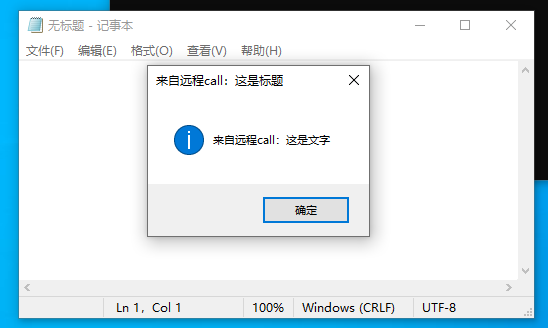

# RemoteCall

RemoteCall uses Kernel APC and KeUserModeCallback to execute code in arbitary process.  
    
  
  
Specific steps are:  
 - Queue a kernel APC 
 - Inside kernel APC, get and set the context to driver io function, when APC is done, user mode will execute the io function
 - Inside driver io function, Execute KeUserModeCallback since it's now the context of target process 
 - Return to normal exection via NtContinue in the rop. 
  
  \
Why not directly set the context to target function in kernel APC?  
-- well, it's okay to do this but using KeUserModeCallback gives user better flexibility and user can get the return value of the function.

### Pros
- No RWX memory/Shellcode needed in target process.  
- Allows users to get the return value of the function (needs modify).  
  
### Cons
- Can be detected by query cfg info.  

### Paste-Friendly
Remote Call is now paste-friendly, which makes it easier to paste and get detected.  
The default config is execute a Messagebox in notepad, so you need to open a notepad. 

